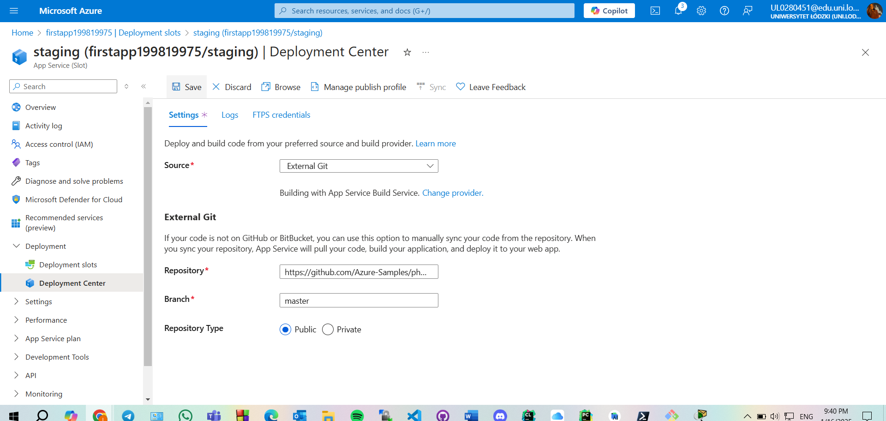

Deployment slots are a powerful feature of Azure App Services that enable seamless testing, staging, and production workflows. Below, you’ll find the steps I followed and the outcomes of my tasks, along with references to screenshots captured during the process.

---

### **Task 2: Create and Configure a Deployment Slot**
1. **Objective**: Create a staging deployment slot for testing changes before going live.
2. **Steps**:
   - Opened the Web App blade in the Azure portal.
   - On the Web App **Overview** blade, clicked on the **Default domain** link to view the initial app screen.

	
     - Observed the default "Your App Service app is up and running" message in the browser.

	
   - Returned to the Azure portal and clicked **Deployment slots** under the Deployment section.

	
   - **Upgraded the Web App to the Premium tier to enable deployment slots.**

	
	

   - Selected **Add slot** with the following settings:
     - **Name**: `staging`
     - **Clone settings from**: `Do not clone settings`
   - Verified the staging slot was created with a unique URL.
	

3. **Outcome**: Successfully created a staging slot for pre-production testing.

---

### **Task 3: Configure Web App Deployment Settings**
1. **Objective**: Configure the deployment settings to enable continuous deployment from an external Git repository.
2. **Steps**:
   - Navigated to the **staging slot** blade.

	
   - Accessed **Deployment Center** > **Settings**.
   - Configured the following:
     - **Source**: External Git

	
     - **Repository URL**: `https://github.com/Azure-Samples/php-docs-hello-world`
     - **Branch**: `master`

	
   - Saved the settings and verified deployment in the staging slot.

	

   - Opened the staging slot's **Default domain** URL to confirm the "Hello World!" application was deployed.
	
3. **Outcome**: Continuous deployment was successfully configured for the staging slot.

---

### **Task 4: Swap Deployment Slots**
1. **Objective**: Swap the staging slot with the production slot to make the tested code live.
2. **Steps**:
   - Navigated to the **Deployment slots** blade.
   - Selected **Swap** to exchange the `staging` and `production` slots.
	
	

   - Reviewed and confirmed the default settings before starting the swap.
   - Verified the production slot displayed the "Hello World!" page using the **Default domain** URL.
	

2. **Outcome**: Successfully swapped the staging slot with the production slot.

