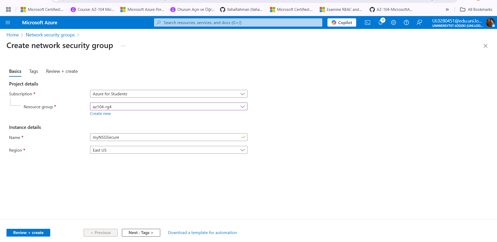

# Configure NSG and ASG in the Core VNet

In this task, we focused on securing traffic inside the Core Virtual Network using **Network Security Groups (NSG)** and **Application Security Groups (ASG)**. These tools allow us to filter network traffic based on source, destination, port, and protocol in a more flexible and scalable way than traditional IP-based rules.

---

The goal of this task was to:

- Create a **Network Security Group (NSG)** to control traffic to/from our subnets
- Create an **Application Security Group (ASG)** to prepare for more dynamic and scalable security rules
- Associate the NSG with the appropriate subnets for enforcement

---

###  NSG Configuration

- We created a single NSG named: `CoreVnet-Nsg`
- At this stage, no custom rules were added — we rely on the default rules:
  - Allow Azure load balancer inbound
  - Deny all inbound traffic
  - Allow all outbound traffic
	
	
	

NSGs work like virtual firewalls for your subnets. By applying one to a subnet, we can tightly control which traffic is allowed in or out.

---

### ASG Creation

- One ASG was created (as shown in the screenshots)
- The ASG is not used in any rule yet, but it's ready for future use
 	
	
	

 ASGs make it easier to manage traffic flows between applications by grouping together VMs logically. Instead of updating IPs manually in NSG rules, we’ll later refer to the ASG name.

---

### Subnet Association

- The NSG `CoreVnet-Nsg` was attached to the following subnets:
  - `SharedServicesSubnet`
  - `DatabaseSubnet`
	!Subnet Association](./Screenshots/subnet.png)

Associating the NSG with these subnets ensures that the default security rules are now being enforced. This means:

- **Inbound Rules:** By default, all inbound traffic from the internet or other external sources is blocked, unless explicitly allowed. This protects our subnets from unsolicited or potentially harmful connections.

	
	
	

  
- **Outbound Rules:** By default, all outbound traffic from resources inside the subnet is allowed. This means VMs or services within the subnet can reach the internet or other Azure services, unless you later define a rule to block it.

	!OB rules](./Screenshots/OBD.png)
	!OB rules](./Screenshots/OBD1.png)
	!OB rules](./Screenshots/OBD2.png)

This default setup provides a secure baseline. It prevents unwanted inbound access while still allowing outbound traffic for updates, logging, and other operations that typically require internet connectivity.

---

## Result

After completing this task:

- Both subnets now have a default-deny inbound rule applied
- Outbound traffic is still unrestricted (per default NSG rules)
- An ASG exists and is ready for future use in advanced rules

 
