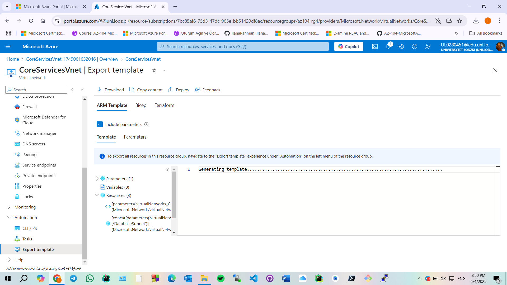
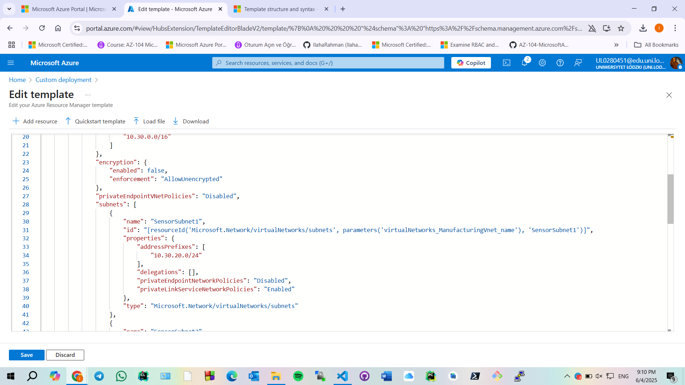
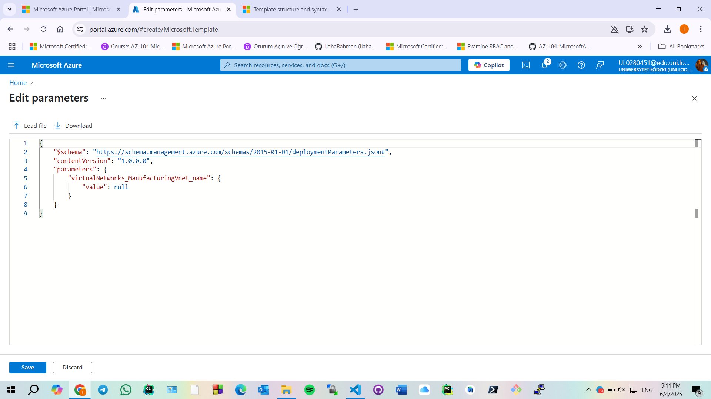

# Deploy Virtual Network using ARM Template

This task demonstrates how to deploy the same virtual network (`CoreServicesVnet`) and subnets that were previously created via the Azure Portal—this time using an ARM (Azure Resource Manager) template.

##  Task Goal

Automate the deployment of a virtual network using the `template.json` and `parameters.json` files exported from the Azure Portal in Task 1.

## 📂 Files Used

- `template.json` – Defines the infrastructure (VNet, address space, subnets, etc.)
- `parameters.json` – Supplies specific values to the template

## 📌 Steps Performed

1. **Uploaded the exported ARM template files** from the previous task.

	

2. **Modified the parameter file** to reflect the same values as the manual deployment:
   - VNet name: `CoreServicesVnet`
   - Location: `East US`
   - Address space: `10.20.0.0/16`
   - Subnets:
     - `SharedServicesSubnet` – `10.20.10.0/24`
     - `DatabaseSubnet` – `10.20.20.0/24`
 
	
	