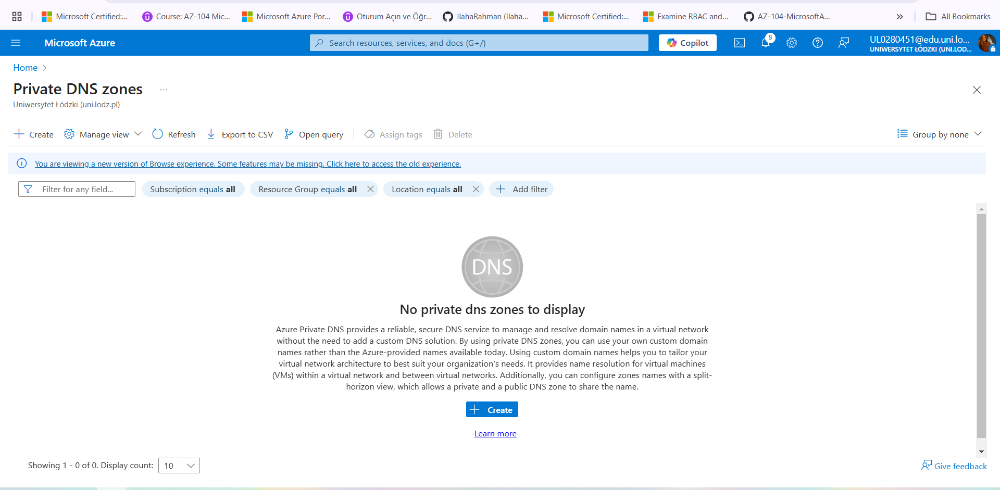
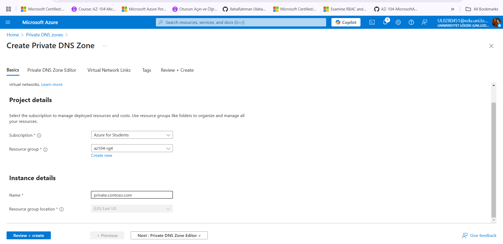
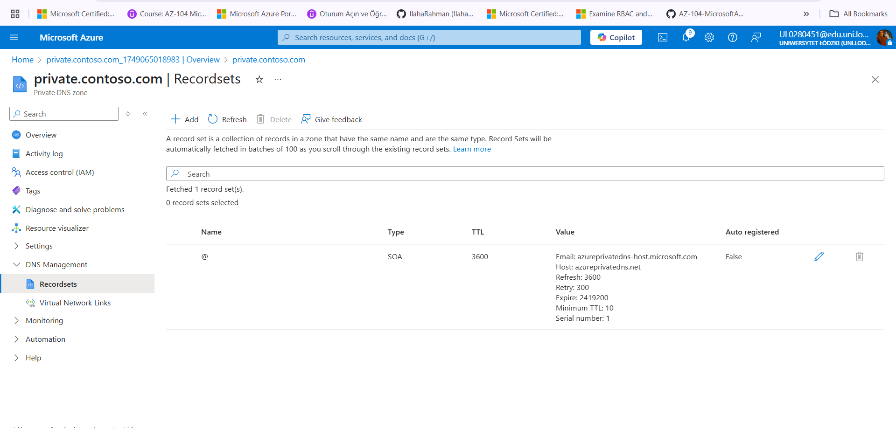
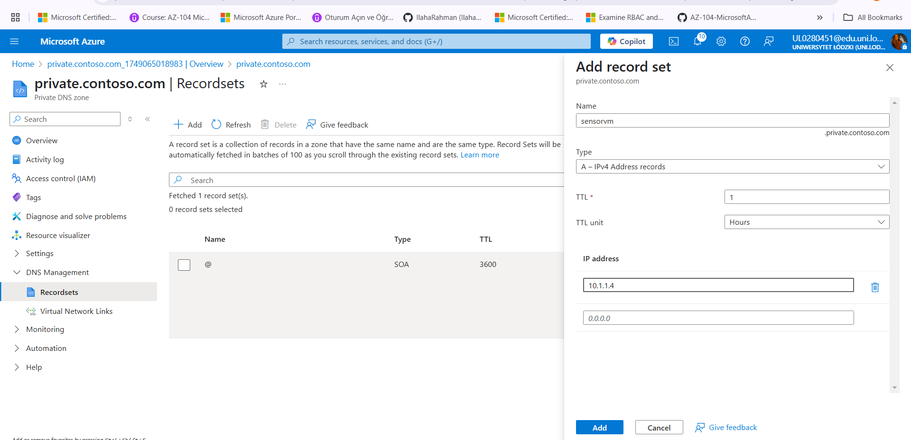
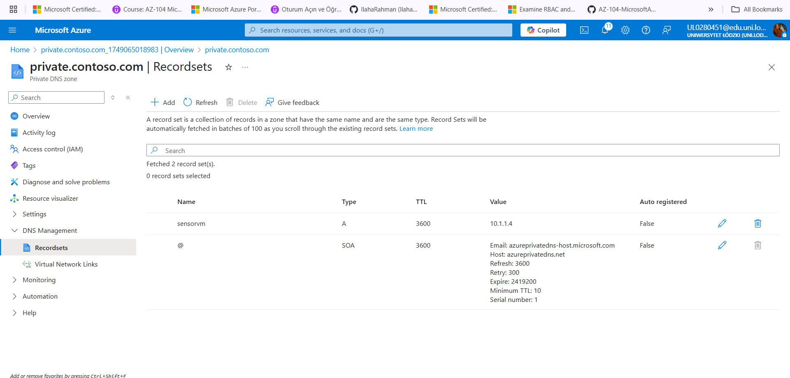

# Azure DNS Zone Configuration (Public & Private)

In this task, I explored how to manage name resolution in Azure by setting up both **Public** and **Private DNS Zones**. 
DNS is a critical part of networking, and Azure gives us the ability to manage internal and external name resolution directly from the portal.

---

## Objective
- Configure a **Private DNS Zone**, link it to a virtual network, and add internal A records
- Test and verify name resolution

---
## Private DNS Zone

- Created a private DNS zone: `private.contoso.com`

	
	
	

- Linked it to the `ManufacturingVnet` using a virtual network link named `manufacturing-link`
	!Vnet](./Screenshots/Vnet.png)

- Added an internal A record: `sensorvm` pointing to IP: `10.1.1.4`

	
	
	
 
Private DNS zones provide name resolution **within** one or more virtual networks. This allows internal resources like VMs to resolve each other using hostnames instead of IPs, which simplifies management and improves security (since names are easier to remember and are not exposed publicly). By linking the zone to `ManufacturingVnet`, only that network can resolve records in this DNS zone.

 
