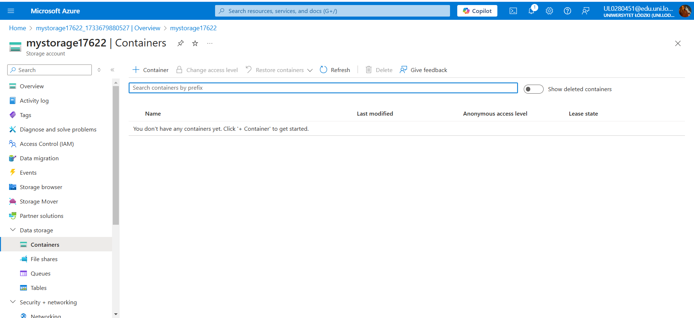
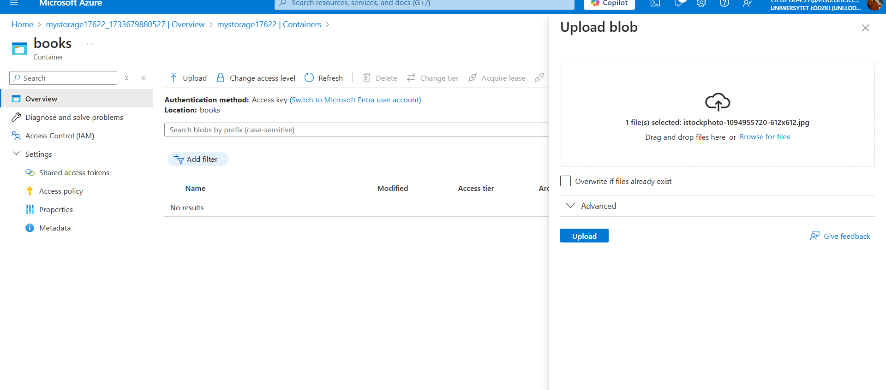
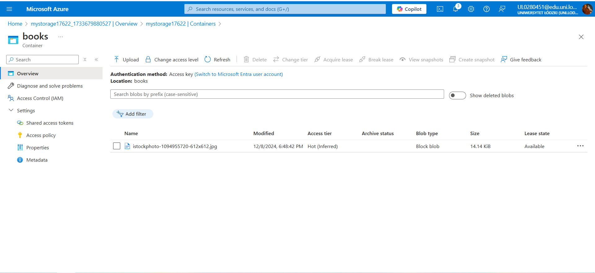

# Azure Blob Storage Setup - Books Container

## Overview
Azure Blob Storage is a scalable and secure way to store data. In this example, I:
1. Created a blob container named **books**.
2. Uploaded an image file to the container.
3. Documented the process with screenshots.

## Steps

### 1. Creating a Blob Container
Using the Azure Portal, I created a storage account and a blob container named **books**. The container is set up to store image files securely.

### 2. Uploading an Image
I uploaded an image file to the **books** container using the Azure Portal. 

### 3. Verifying the Upload
After uploading, I verified that the image was successfully stored in the blob container. The file can be accessed (if permissions allow) via the container URL.

## How to Use
- Navigate to the **books** container via the Azure Portal to access the uploaded image.
- You can adjust access policies to make the container public or private based on your needs.

