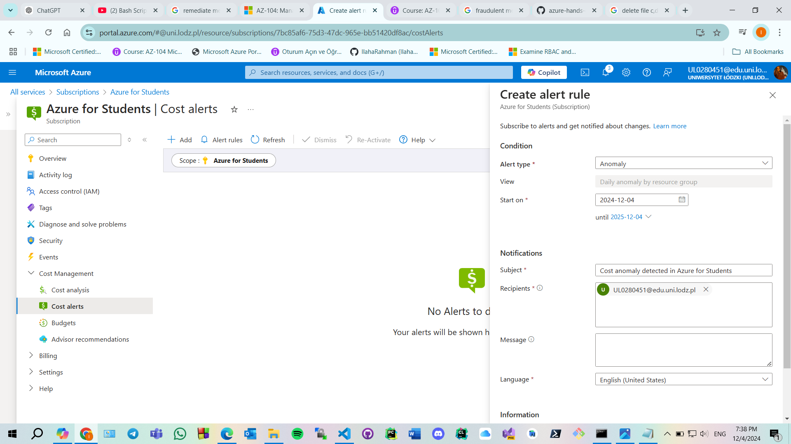
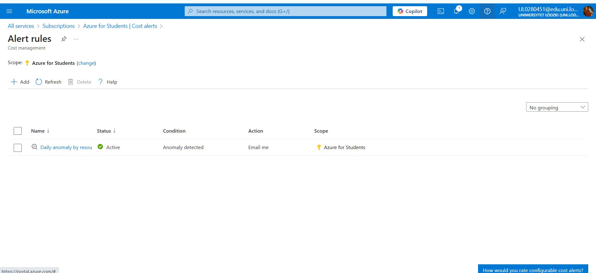

Cost anomalies in cloud services can arise due to unforeseen usage spikes or resource misconfigurations. 

### 2. Configure the Cost Alert to Detect Anomalies
- Choose the **Azure for Students** subscription.
- Set up the alert with the following details:
  - **Alert Name**: Enter a descriptive name ("Daily anomaly by resource group").
  - **Notification Settings**: Add an email address where you want to receive alerts in case of any anomalies.

## Why Detecting Cost Anomalies Matters

Cost anomalies in cloud environments can result from:
- Unforeseen spikes in resource usage.
- Misconfigured services leading to high costs.
- Unexpected increases in demand due to mismanagement or erroneous code.

Setting up an alert ensures that you receive notifications in case any of these anomalies occur, allowing you to take immediate corrective actions before the costs spiral out of control.

## Conclusion

By setting up this cost alert, I can proactively monitor my **Azure for Students** subscription for any anomalies, helping to avoid unexpected charges and ensuring that my resource usage stays within budget.

