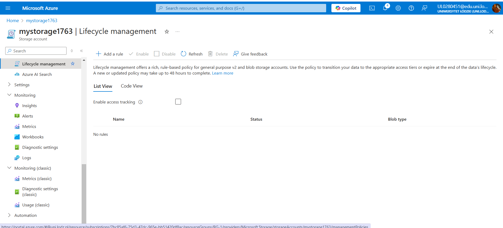
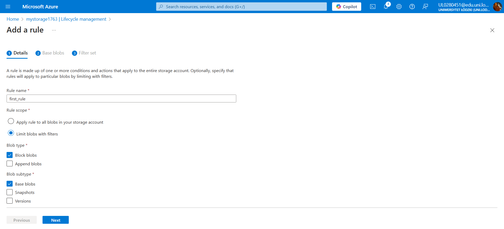
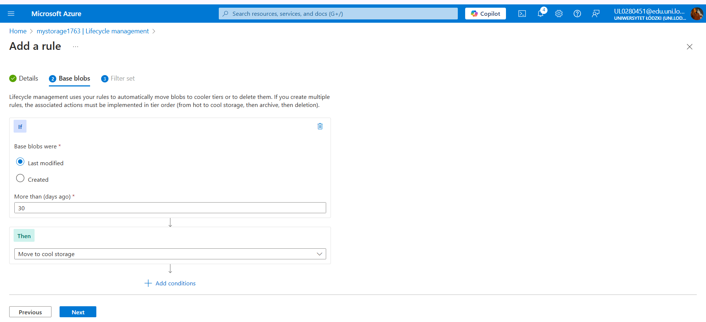
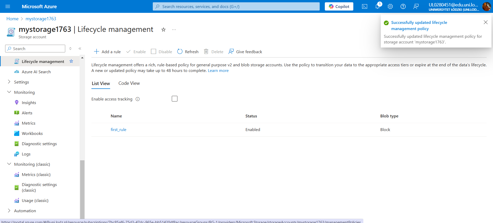

# Azure Blob Storage - Books Container Lifecycle Management

This repository documents the steps I followed to configure lifecycle management for the **books** blob container in Azure Blob Storage. The lifecycle management rule moves blobs to the **Cool** tier if they are not modified for more than 30 days. This setup helps in managing storage costs by automatically moving less frequently accessed data to a lower-cost storage tier.

## Overview
In this example:
1. Created an Azure Blob Storage container named **books**.
2. Uploaded an image file to the container.
3. Configured lifecycle management to automatically move blobs to the **Cool** tier if they haven’t been modified for more than 30 days.
4. Documented each step with screenshots.

## Steps

### 1. Configuring Lifecycle Management
I configured lifecycle management to automatically move blobs to the **Cool** tier if they are not modified for more than 30 days. This is achieved through the Azure Portal.

#### a. Accessing the Lifecycle Management Settings
Navigate to the **books** container in the Azure Portal. Select `Lifecycle management` under `Configuration`.

#### b. Adding a New Lifecycle Rule
Click on `+ Add lifecycle rule` to create a new rule.

#### c. Configuring Rule Conditions
Define the conditions for the lifecycle rule. I chose to move blobs to the **Cool** tier if they are not modified for more than 30 days.

#### d. Saving the Rule
After configuring, save the lifecycle management rule. Now, any blob in the **books** container that meets the conditions will automatically be moved to the **Cool** tier.

## How to Use
1. Navigate to the **books** container in the Azure Portal.
2. Access the `Lifecycle management` settings.
3. Add a new lifecycle rule to move blobs to the **Cool** tier if they are not modified for more than 30 days.
4. Verify that the lifecycle rule is applied correctly by checking the `Lifecycle management` tab.

