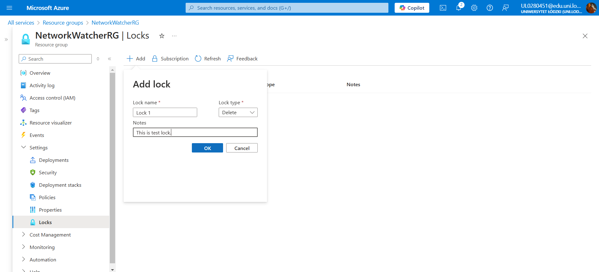
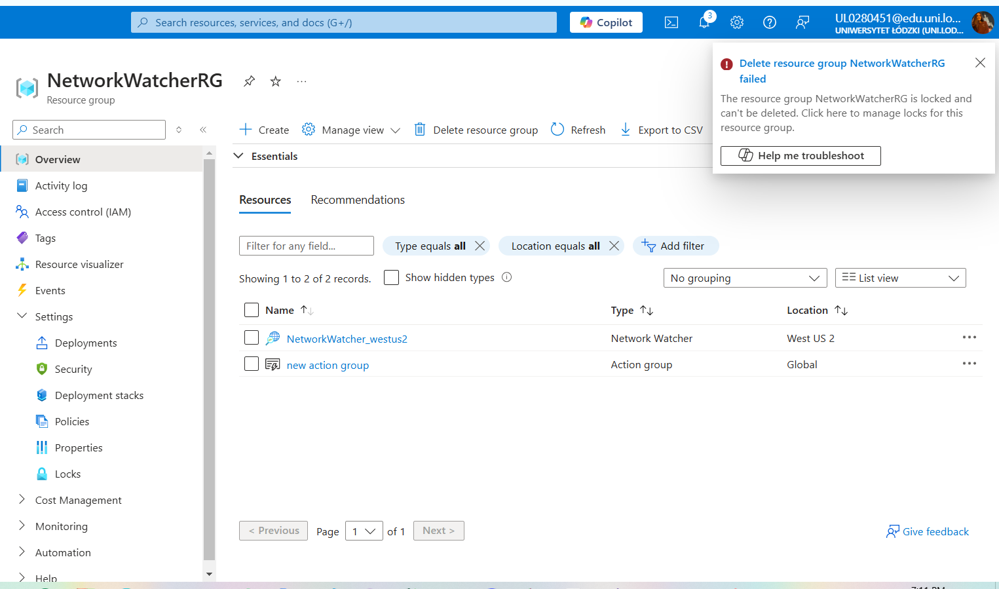

# Resource Group Lock Setup in Azure

Azure resource locks provide a layer of protection for resources. By applying a **Read-Only** or **Delete** lock, you can safeguard critical resources against unintended actions.

In this example, I applied a **Delete Lock** on a resource group and tested its functionality.

---

## Steps to Apply a Lock

### 1. Add a Lock to the Resource Group
- Navigate to the desired resource group in the **Azure Portal**.
- In the left-hand menu, select **Locks** under the **Settings** section.
- Click **+ Add** to create a new lock:
  - **Lock Name**: Provide a descriptive name for the lock.
  - **Lock Type**: Choose **Delete** to prevent deletion of the resource group.
  - **Notes**: Optionally, add notes for reference.

### 2. Verify the Lock
- After creating the lock, it will appear in the list of locks for the resource group.
- Confirm the lock details (name, type, and notes) to ensure the configuration is correct.

### 3. Test the Lock by Attempting to Delete the Resource Group
- Try to delete the resource group from the **Azure Portal**.
- The deletion attempt will fail with a message indicating that the operation is not permitted due to the applied lock.

## Why Use Resource Locks?

Applying resource locks is essential for:
- **Preventing Accidental Deletion**: Safeguard critical infrastructure against unintended removal.
- **Enhancing Security**: Ensure resources remain unchanged without proper authorization.
- **Maintaining Operational Stability**: Protect vital services from disruptions caused by unauthorized modifications.

## Conclusion

This hands-on experience demonstrates the importance of resource locks in Azure for maintaining resource integrity. By applying a **Delete Lock**, I ensured that my resource group remains protected from accidental deletions.

