# Azure Storage Account Configuration

This guide provides detailed steps for creating and configuring an Azure Storage Account using the Azure Portal.

---

## Steps to Configure the Storage Account

### 1. Basics
1. Log in to the [Azure Portal](https://portal.azure.com).
2. Navigate to **Storage Accounts** and click **Create**.
3. Fill in the required fields:
   - **Subscription**: Select your subscription, (Azure Students).
   - **Resource Group**: Create a new resource group or select an existing one (RG1)
   - **Storage Account Name**: Enter a unique name (`storage19723723`).
   - **Region**: Choose a region (`westeurope`).
   - **Performance**: Choose `Standard` for general-purpose storage.
   - **Redundancy**: Select a redundancy option (`Locally-redundant storage (LRS)`).
   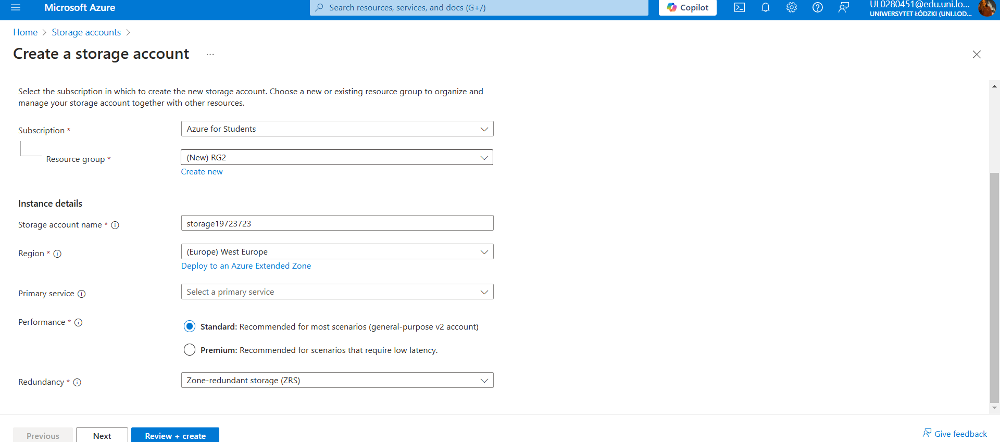

### 2. Advanced
1. Configure the **Advanced** settings:
   - **Encryption**: Select `Microsoft-managed keys`.
   - **Minimum TLS Version**: Set to `1.2`.
   - **Allow Blob Public Access**: Choose `Disabled` for security.
   - **Large File Shares**: Enable if required, especially for file storage needs.
     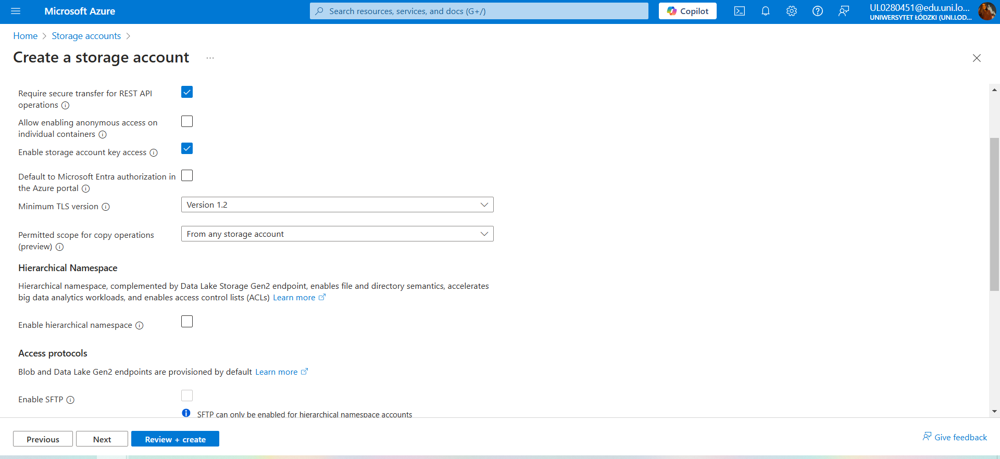
     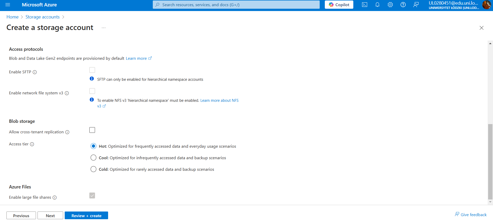

### 3. Networking
1. Specify how the storage account can be accessed:
   - **Public Network Access**: Choose `Enabled`.
   - **Allow Public Access**: Set to `Disabled` to restrict public access.
   - **Firewall and Virtual Networks**: Add IP addresses or virtual networks if required.
  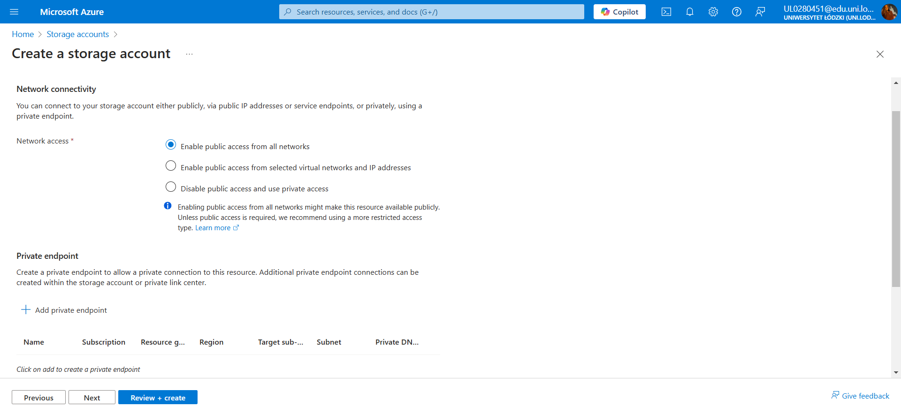
  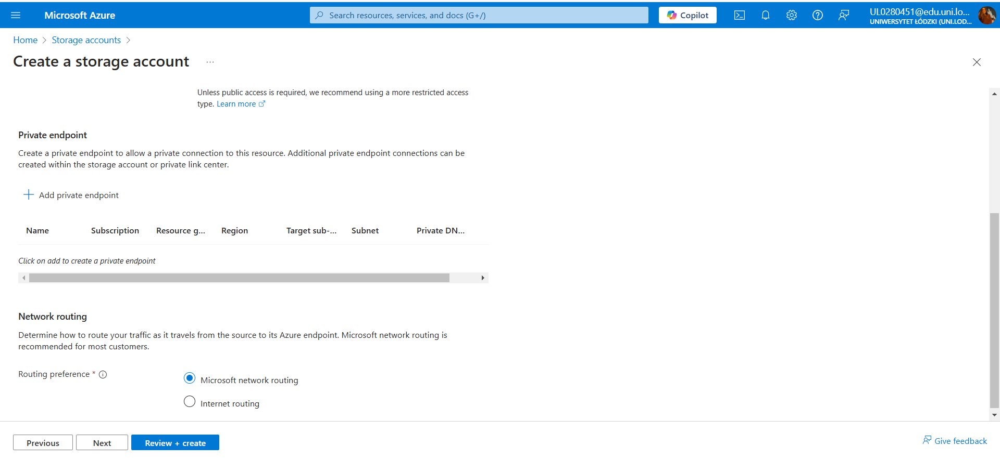

### 4. Data Protection
1. Configure data protection features:
   - **Blob Soft Delete**: Enable and set retention days to `7`.
   - **Container Soft Delete**: Enable and set retention days to `7`.
   - **Versioning for Blob Storage**: Enable to track versions of objects.
  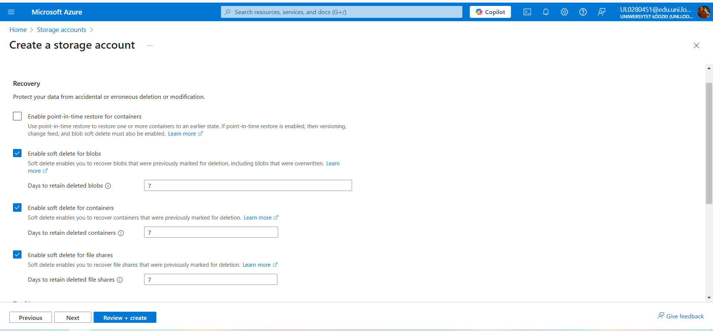
  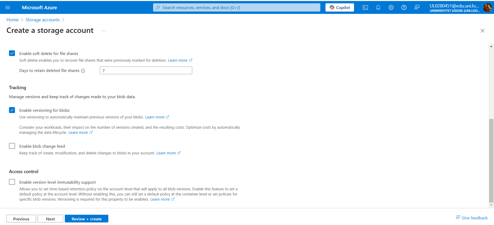

### 5. Tags
1. Add tags to help organize your resources. For example:
   - `Environment`: `...`

### 6. Review and Create
1. Navigate to the **Review + Create** tab.
2. Validate all the configuration settings:
   - Ensure the **Region** is `Western Europe`.
   - Verify the **Storage Account Name** meets naming requirements (lowercase, alphanumeric, 3-24 characters).
  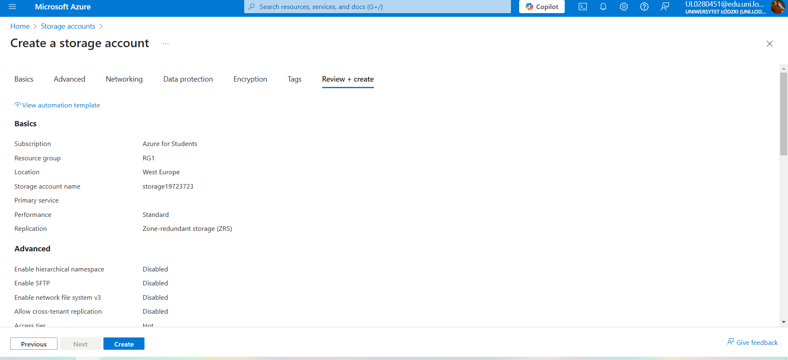
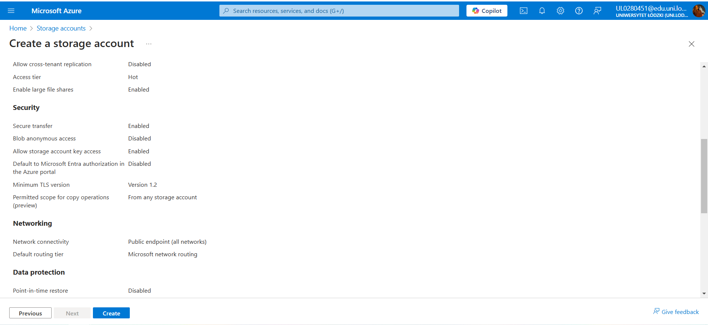
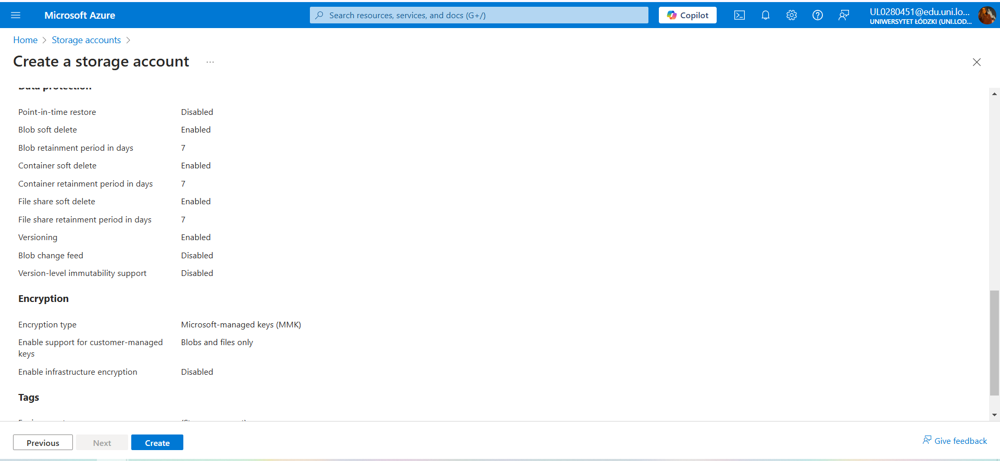
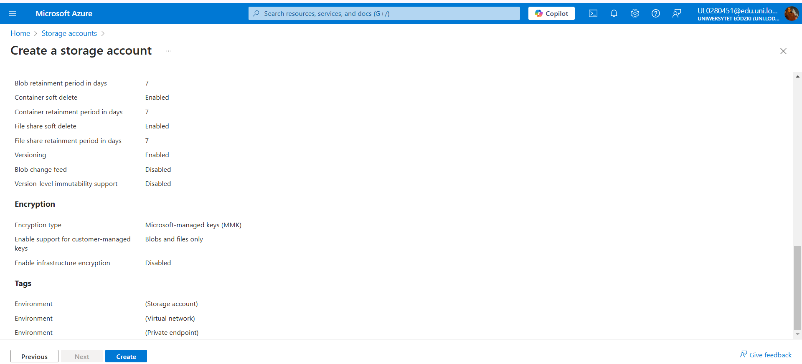

3. Click **Create** to deploy the storage account.

---

