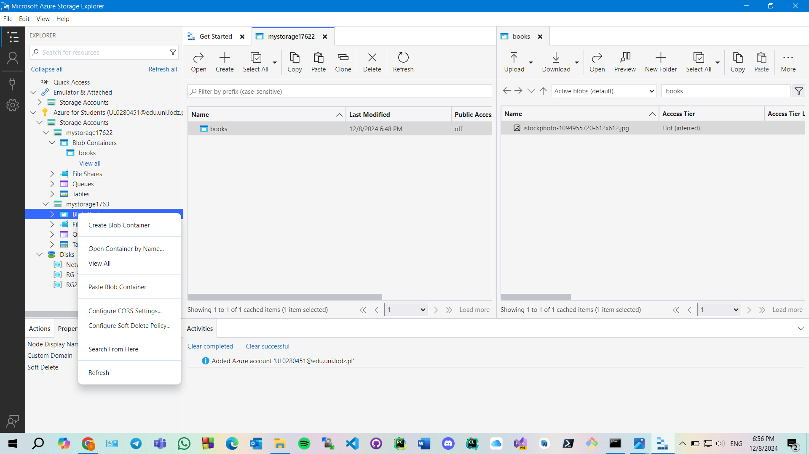

# Azure Blob Storage - Books Container Copy Using Azure Storage Explorer

This repository documents the steps I followed to use **Azure Storage Explorer** to copy the **books** container from one Azure Storage account to another. Screenshots are included to guide through the process.

## Overview
In this example:
1. Created an Azure Blob Storage container named **books**.
2. Uploaded an image file to the original container.
3. Used Azure Storage Explorer to copy the container from one storage account to another.
4. Documented each step with screenshots for clarity.

### 3. Using Azure Storage Explorer
Using Azure Storage Explorer, I copied the **books** container from one Azure Storage account to another. 

#### a. Opening Azure Storage Explorer
Launch Azure Storage Explorer and connect to both the source and the destination storage accounts.

#### b. Selecting the Source Container
Navigate to the source storage account, select the **books** container you want to copy.

#### c. Copying the Container
Right-click on the container and choose the `Copy` option. Then, navigate to the destination storage account and paste (or drag and drop) the container.

#### d. Verifying the Copy
After copying, verify that the container and its contents have been successfully transferred to the destination storage account.

## How to Use
1. Connect to your Azure Storage accounts using Azure Storage Explorer.
2. Navigate to the **books** container in the source account.
3. Copy the container and paste it into the destination account.

