# Virtual Machine Setup

This repository contains my hands-on experience of creating and managing a Virtual Machine (VM) on Microsoft Azure. Below is a detailed step-by-step guide.

## Explore my Azure Dashboard:
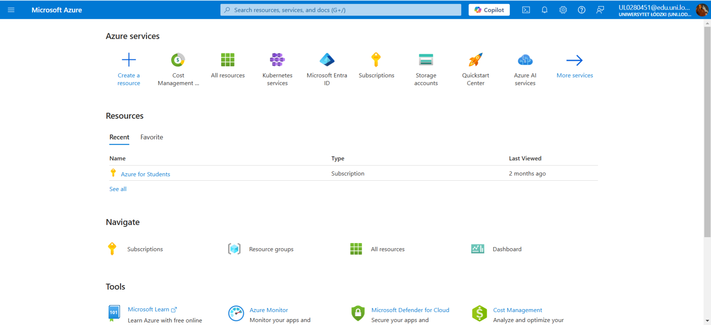

## Step 1: Create a Resource Group
First, I created a Resource Group using the Azure Portal. 
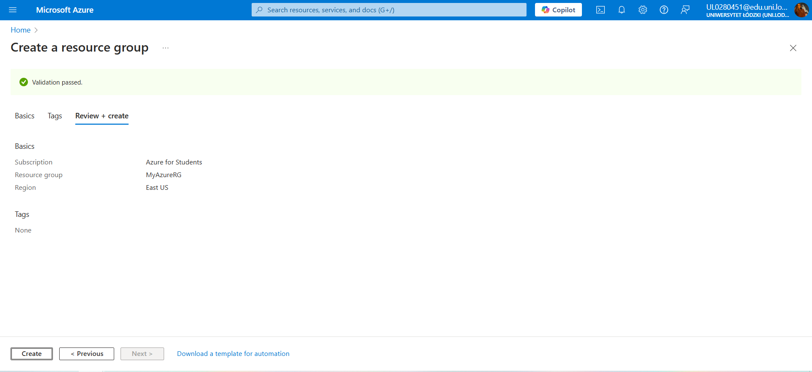

## Step 2: Configure VM Settings
I configured the basic settings for the VM, including the region, size, and operating system.

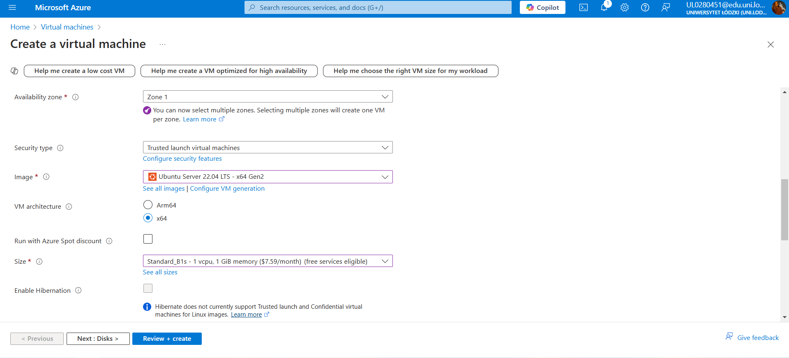

## Step 3: Configure Disks and Network
Next, I configured the **disks** and **network** for the VM to ensure proper connectivity.
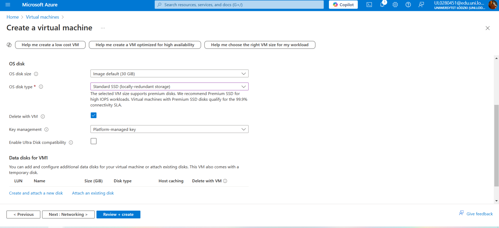
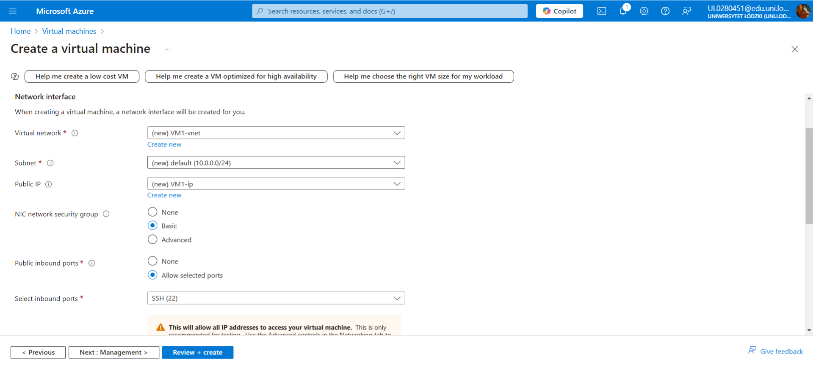c

## Step 4: Review and Create VM
I reviewed the configuration and clicked **Create** to provision the VM.
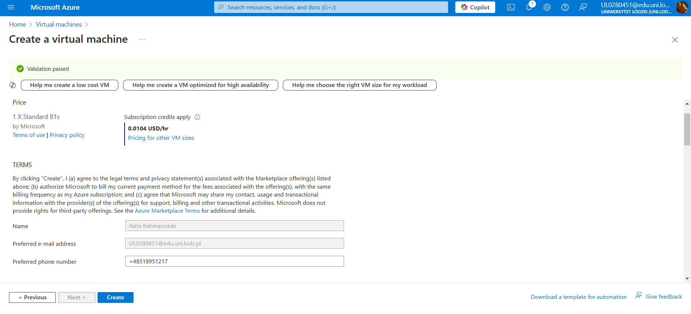
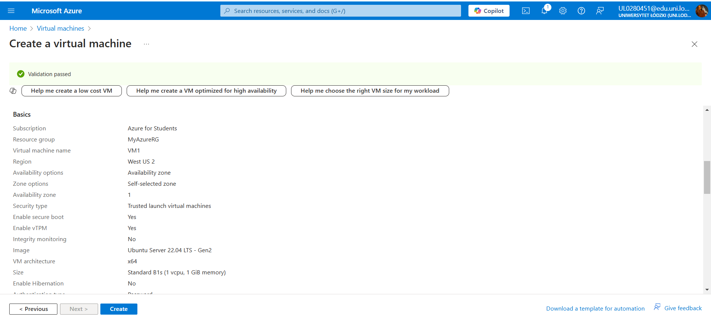
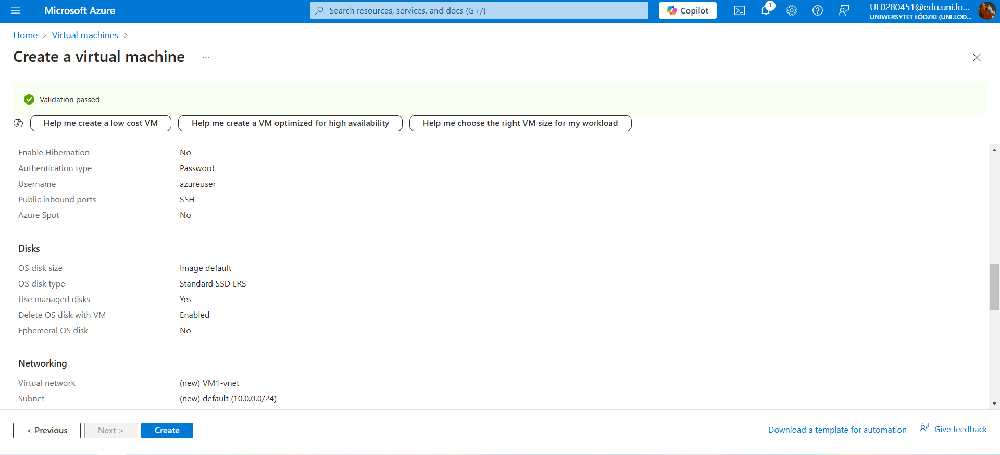
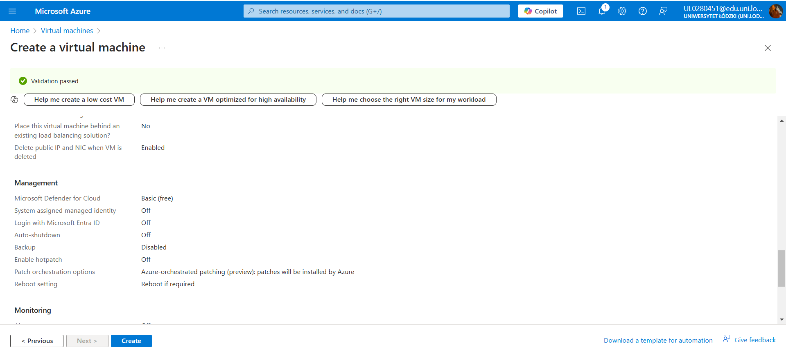
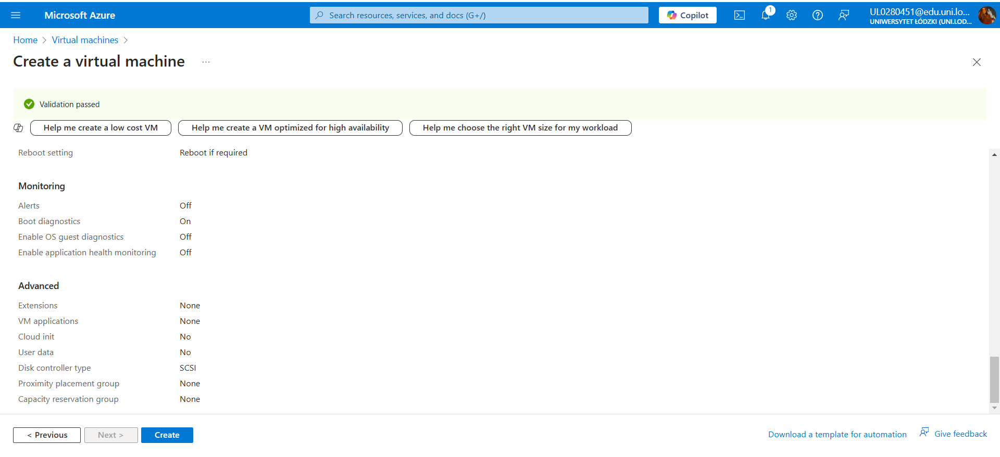

## Step 5: Connect via SSH
Once the VM was created, I connected to it via SSH to verify everything was set up properly.
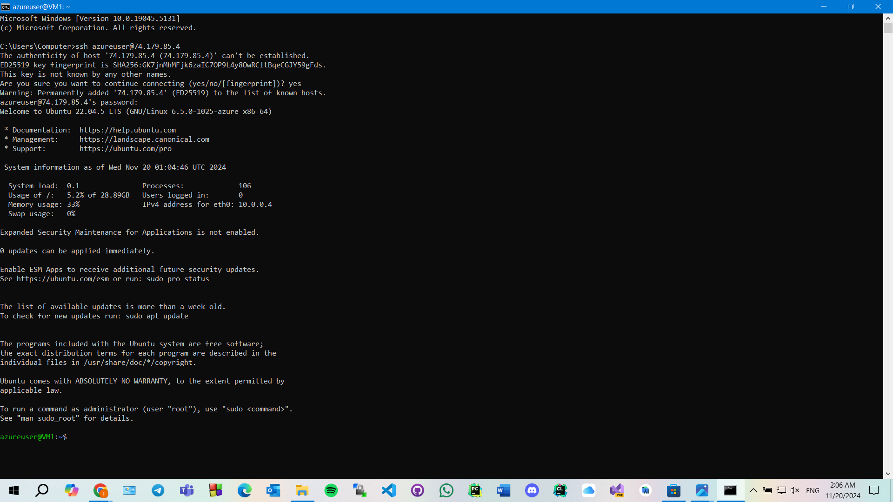

## Step 6: Check Cost and Billing
Finally, I checked the **Cost Management** and **Billing** sections to make sure I wasn’t being charged unexpectedly.

## Conclusion
By following these steps, I successfully created and managed a Virtual Machine in Azure. This process was a great hands-on learning experience.
