# Azure VNet Peering – Hands-On Lab

This project is a hands-on walkthrough of setting up and testing **Virtual Network (VNet) Peering** in Microsoft Azure. The goal was to enable communication between two virtual machines across separate virtual networks using peering and to verify the setup with tools like **Network Watcher** and **PowerShell**.

I already had two VMs running for this exercise:

- `CoreServicesVM`  
- `ManufacturingVM`

---

## What I Did

Here's a step-by-step summary of what I worked on:

### 1. Verified Both VMs Were Up and Running

Before doing anything, I confirmed that both `CoreServicesVM` and `ManufacturingVM` were deployed and in a running state.

---

### 2. Used Network Watcher to Test the Initial Connection

I used **Network Watcher** to check if the two VMs could talk to each other before setting up VNet peering.

**Steps:**

- Went to **Network Watcher** in the Azure portal
- Selected **Connection troubleshoot** under "Network diagnostic tools"
- Configured the following:
  
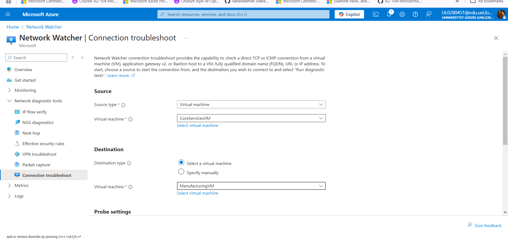
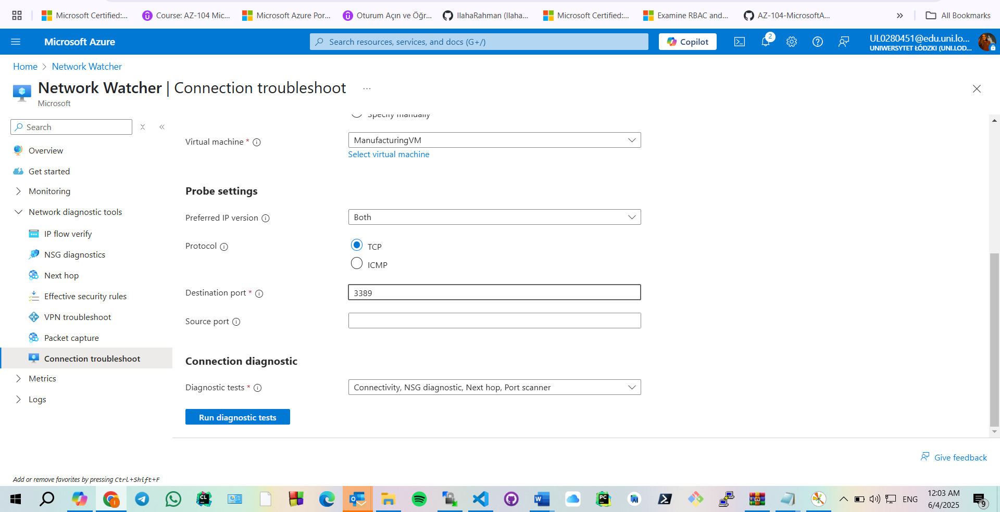
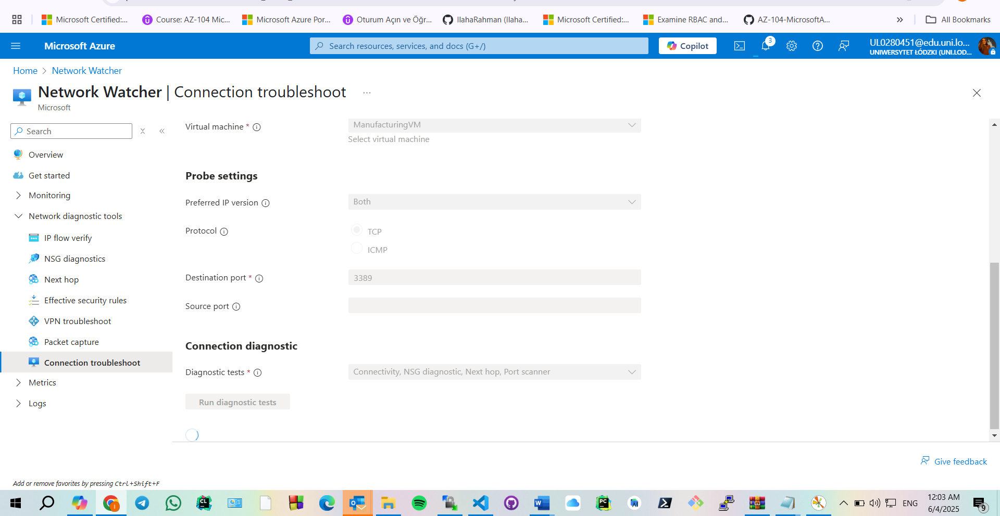


As expected, the connection didn’t work initially since the VNets weren’t yet peered.
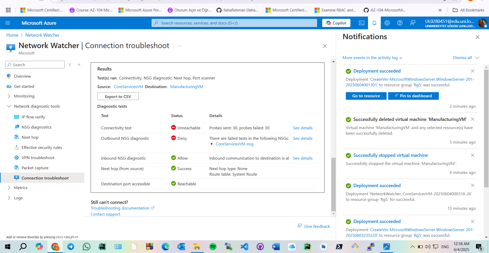

---

### 3. Set Up VNet Peering

Next, I configured VNet peering between `CoreServicesVnet` and `ManufacturingVnet`.

#### On `CoreServicesVnet`:

- Went to **Peerings** under settings
- Clicked **+ Add**


- Set:

  - Peering link name: `CoreServicesVnet-to-ManufacturingVnet`
  - Selected `ManufacturingVM-net (az104-rg5)`
  - Allowed access and forwarded traffic
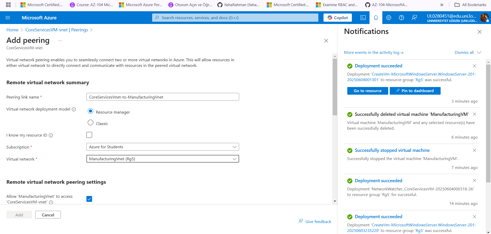


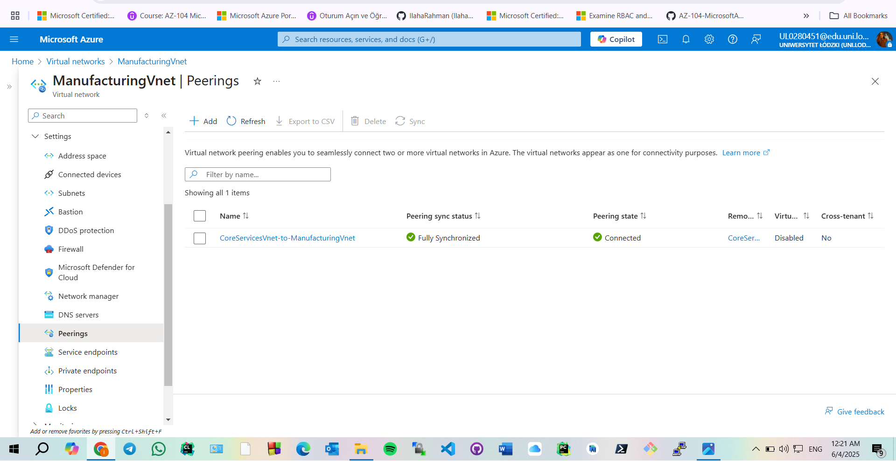

####  On `ManufacturingVnet`:

- Repeated the process to create the reverse peering:
  - Peering link name: `ManufacturingVnet-to-CoreServicesVnet`
  - Allowed access and forwarded traffic as well
!ManufacturingVnet Peering](./Screenshots/Peering7.png)

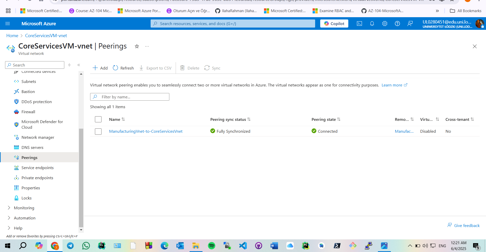

Both peerings showed up as **Connected** after a quick refresh.

---

### 4. Retested the Connection with PowerShell

After peering was set up, I tested the connection again using PowerShell from inside `ManufacturingVM`.

#### Step 1: Got the Private IP of `CoreServicesVM`
 
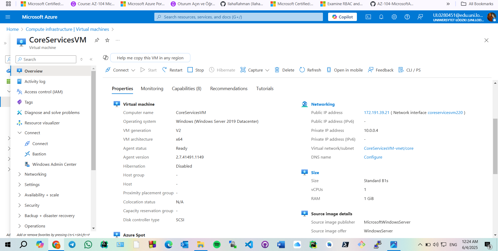

#### Step 2: Ran `Test-NetConnection` on `ManufacturingVM`
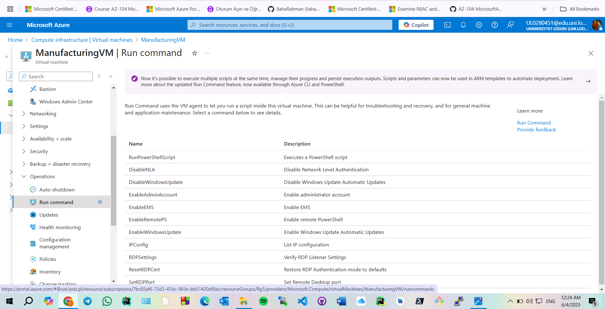

In the **Run Command** blade of the `ManufacturingVM`, I ran this PowerShell script:
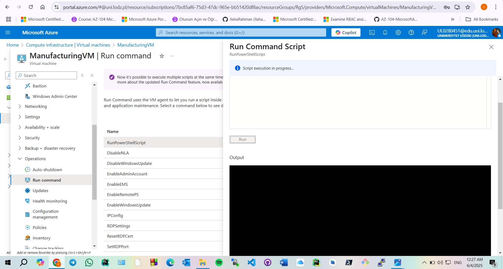

```powershell
Test-NetConnection <CoreServicesVM Private IP> -Port 3389
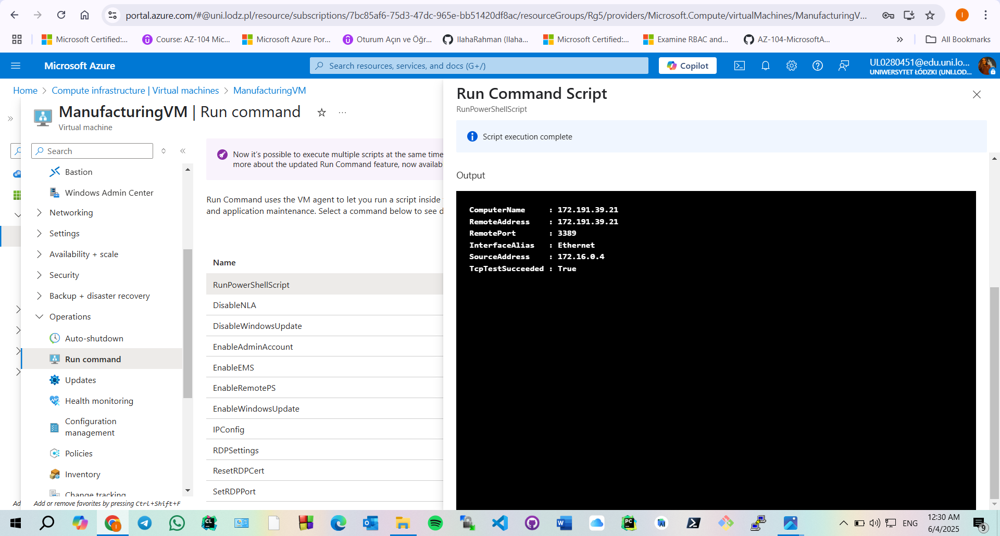
