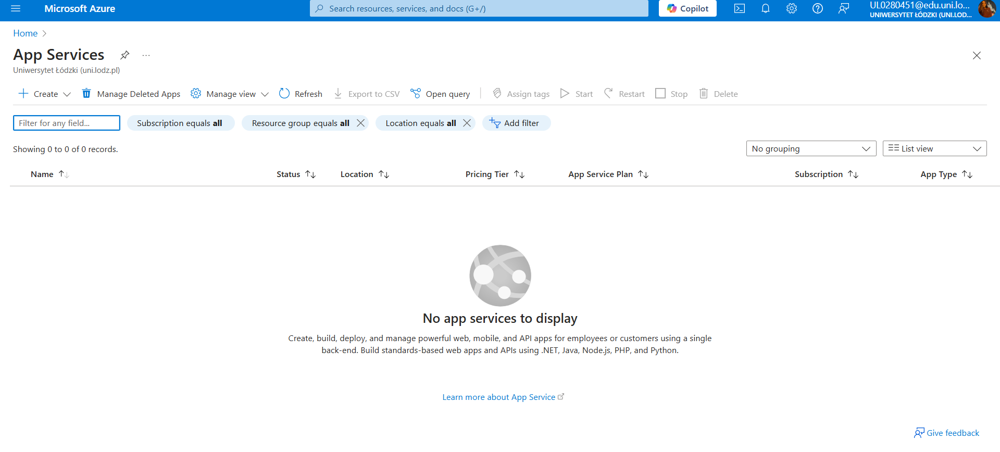
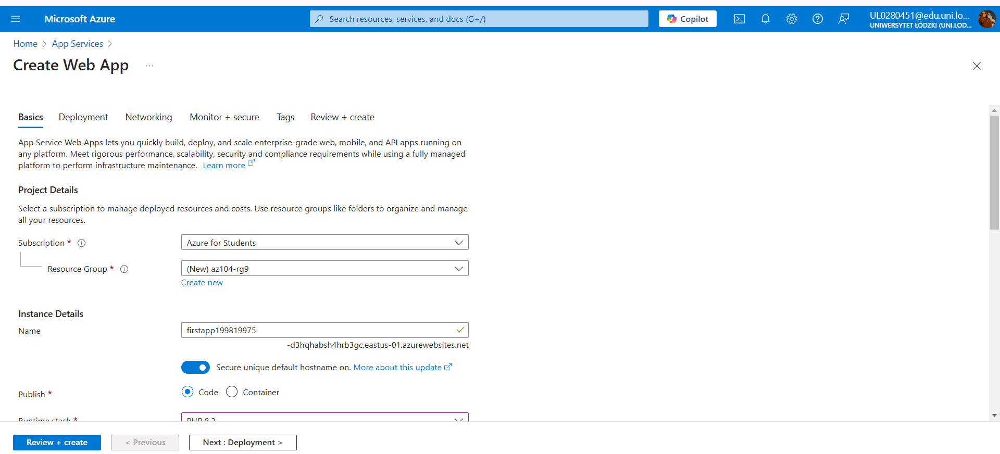
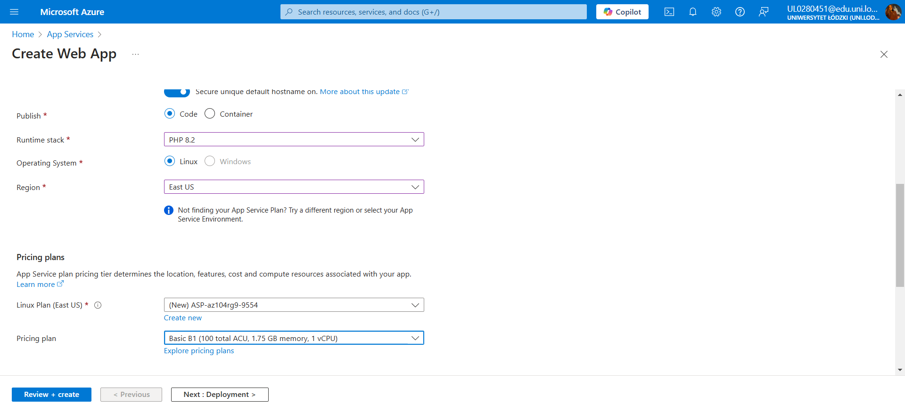
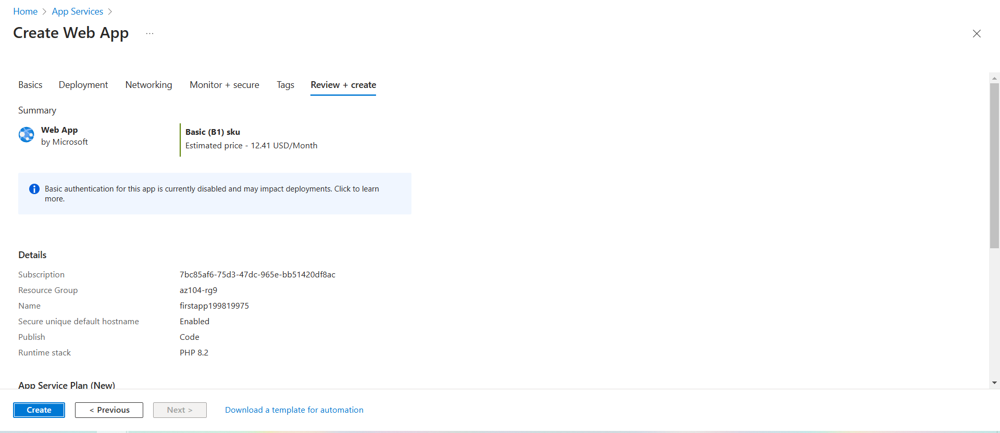
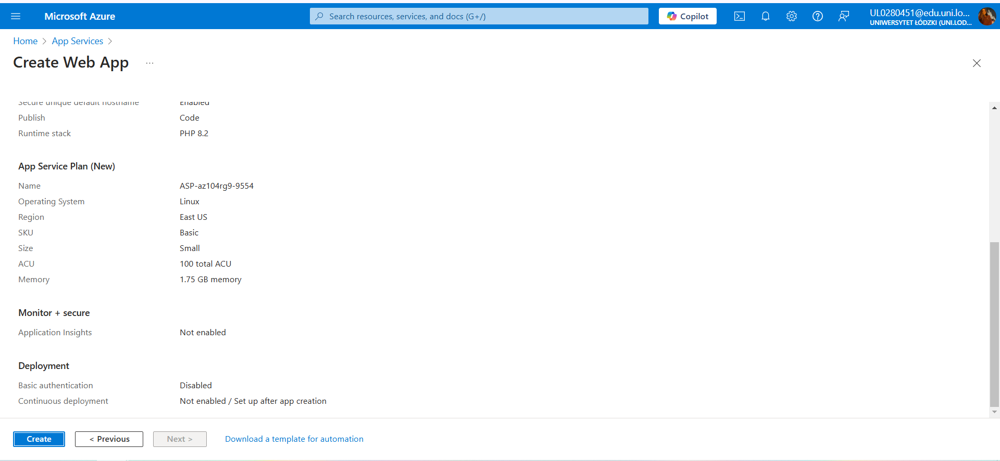
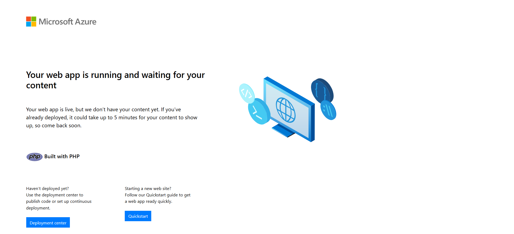
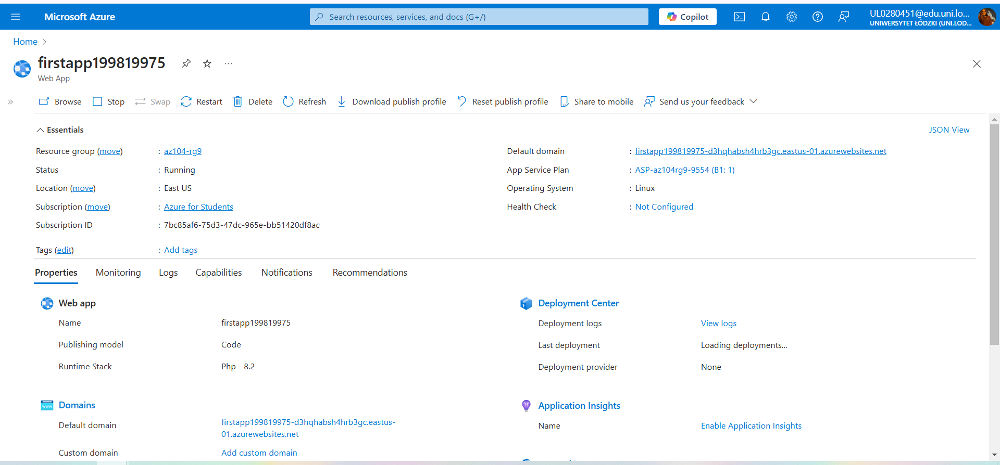

# Azure Web App Creation

This repository documents the process of creating and configuring an Azure Web App using Azure App Services. It includes detailed steps and screenshots to assist with recreating the process.

## Overview

Azure App Services provides a Platform-as-a-Service (PaaS) solution for hosting web, mobile, and other web-based applications. This task demonstrates the creation of a web app using Azure services with PHP as the runtime stack.

## Steps to Create the Azure Web App

1. **Sign in to Azure**
   - Navigate to [Azure Portal](https://portal.azure.com) and log in.

2. **Create a Web App**
   - In the search bar, type **App Services** and select it.
   - Click **+ Create** and choose **Web App** from the menu.
	

3. **Configure the Web App**
   - Fill in the following details under the **Basics** tab:
     - **Subscription**: Azure for Students.
     - **Resource Group**: `az104-rg9` (create new if necessary).
     - **Web App Name**: A globally unique name.
     - **Publish**: `Code`.
     - **Runtime Stack**: `PHP 8.2`.
     - **Operating System**: `Linux`.
     - **Region**: `East US`.
     - **Pricing Plan**: `Premium V3 P1V3`.
        
	

4. **Deploy the Web App**
   - Click **Review + Create** to validate your configuration.
   - Click **Create** and wait for the deployment to finish.
	
	

5. **Access the Web App**
   - After the deployment, click **Go to resource**.
   - See the domain URL in the overview section and open it in a browser to confirm the app is live.
	
	

