# Web App Autoscaling

Autoscaling ensures optimal performance by dynamically adjusting resources based on app traffic and metrics such as CPU usage, memory, or bandwidth. Below, you’ll find the steps I followed and the outcomes of the task, along with references to screenshots captured during the process.

---

### **Task 5: Configure and Test Autoscaling of the Azure Web App**
1. **Objective**: Configure autoscaling for the production slot of an Azure Web App and test its performance under load.
2. **Steps**:
   - Navigated to the Web App blade in the Azure portal.
   - Selected **Scale out (App Service plan)** under the **Settings** section.
	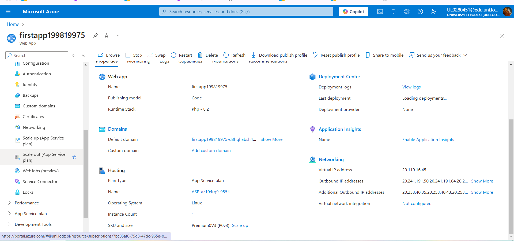

   - Configured the following settings:
     - **Scaling Mode**: Automatic
     - **Maximum burst**: 2
	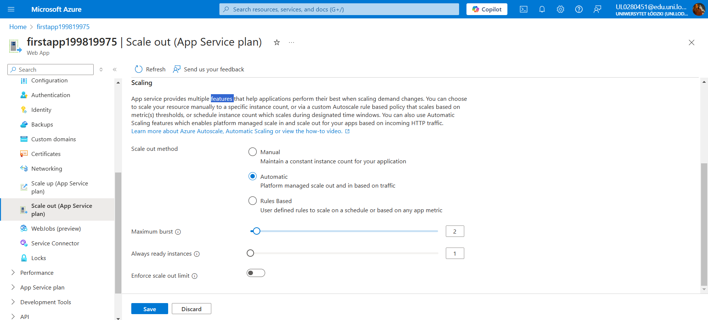
   - Saved the autoscaling configuration.

3. **Load Testing**:
   - Selected **Diagnose and solve problems** from the left pane.
	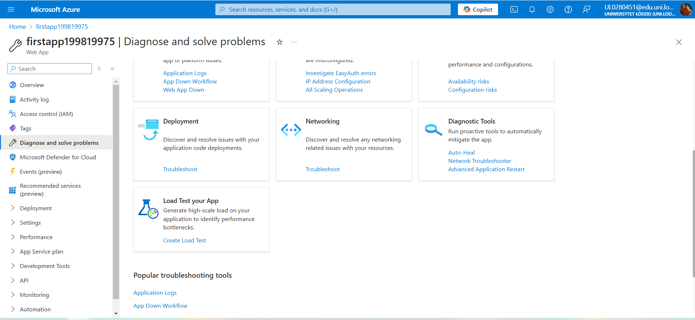

   - In the **Load Test your App** box, selected **Create Load Test**.
	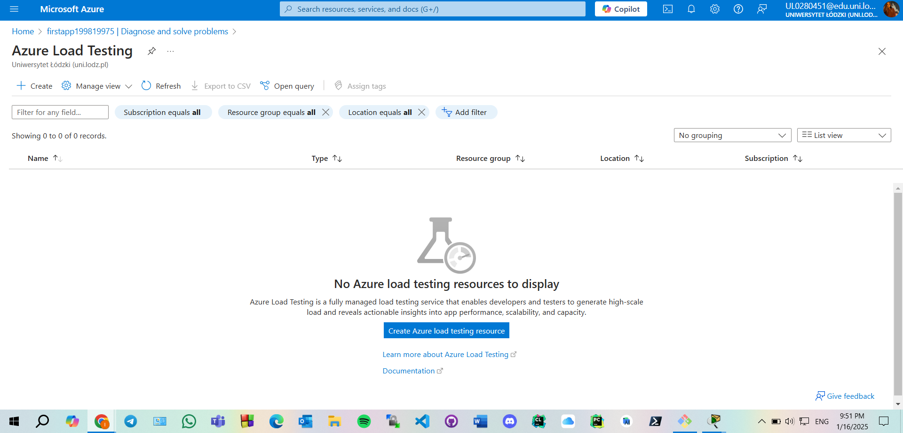

   - Created a new load test with the following steps:
     - Selected **+ Create**, provided a unique name for the load test, and clicked **Review + create** and **Create**.
	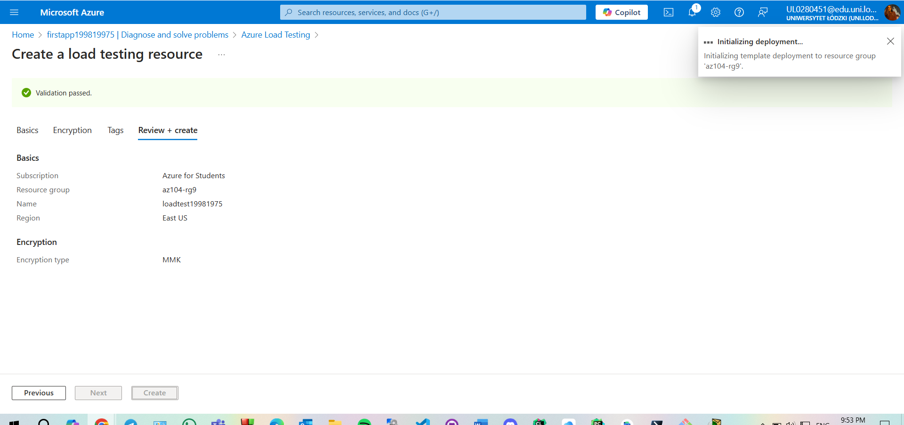

     - Waited for the load test resource to deploy and navigated to the resource.
	
	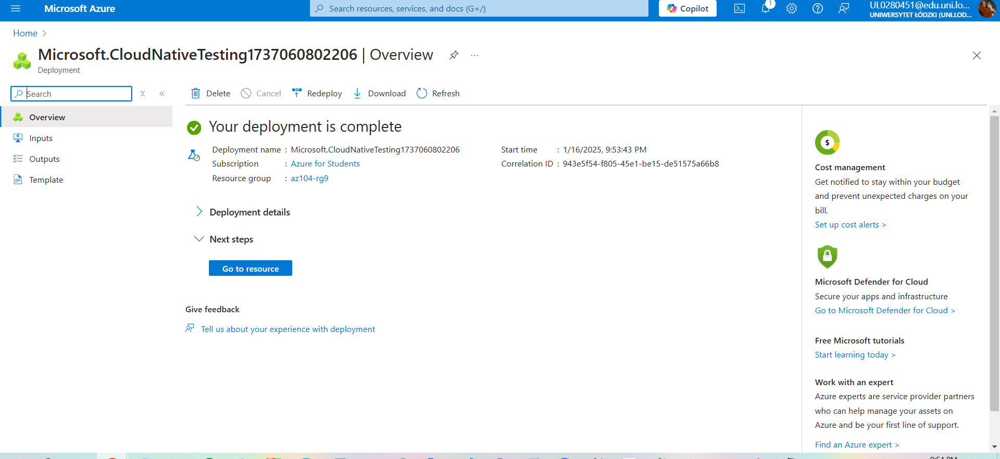

   - From the **Overview | Add HTTP requests** section:
	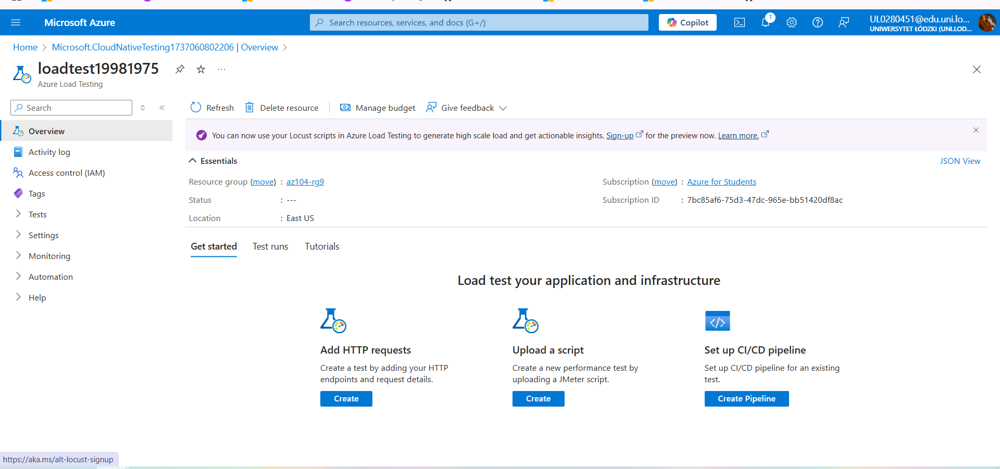
	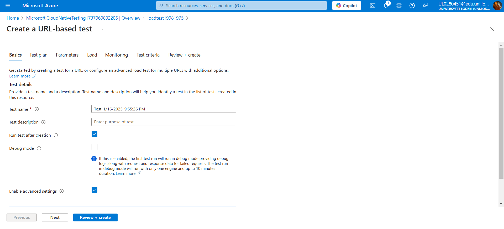
	
     - Clicked **Create**.
     - On the **Test plan** tab, added a new HTTP request:
       - **URL**: Pasted the **Default domain URL** of the production slot (ensured proper format starting with `https://`).
     - Selected **Review + create** and clicked **Create**.
	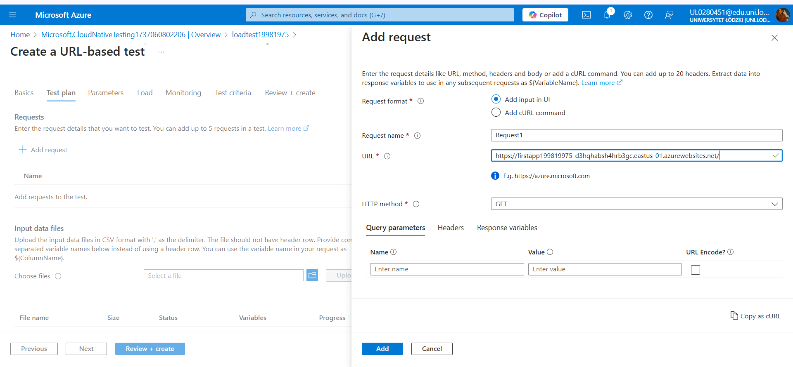
	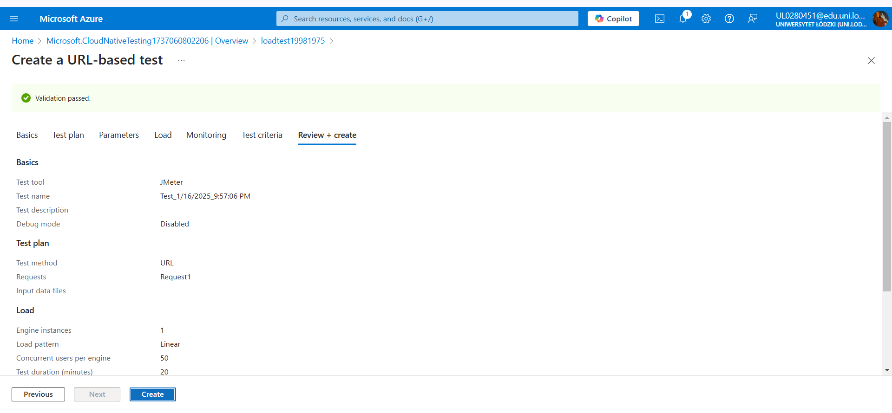

   - After creation, reviewed test results including:
     - **Virtual Users**: The number of simulated users accessing the app.
     - **Response Time**: Average time for the app to respond.
     - **Requests/sec**: Number of requests the app handled per second.
	
	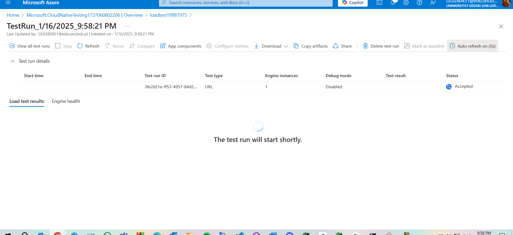
	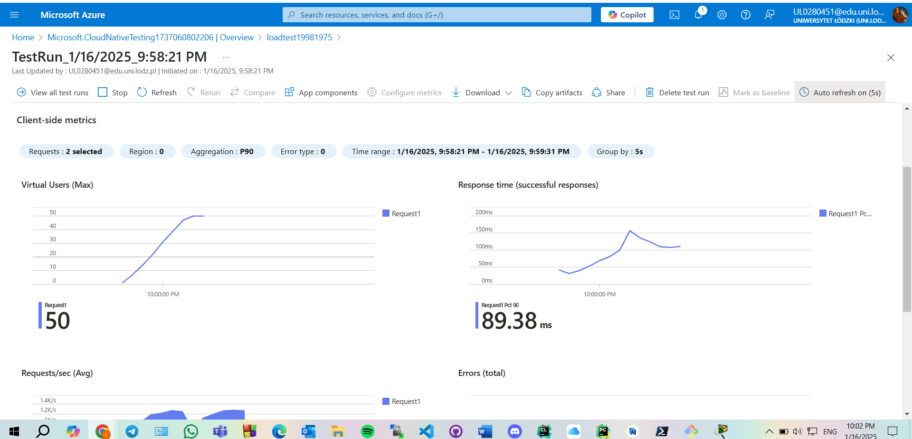
	
	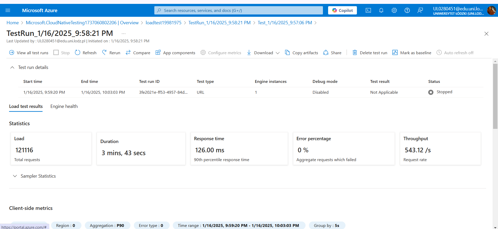

   - Stopped the test manually without waiting for completion to verify autoscaling behavior.

3. **Outcome**:
   - Successfully configured autoscaling and confirmed the app’s ability to scale based on load.
   - Load test results provided insights into performance metrics under stress.

 
